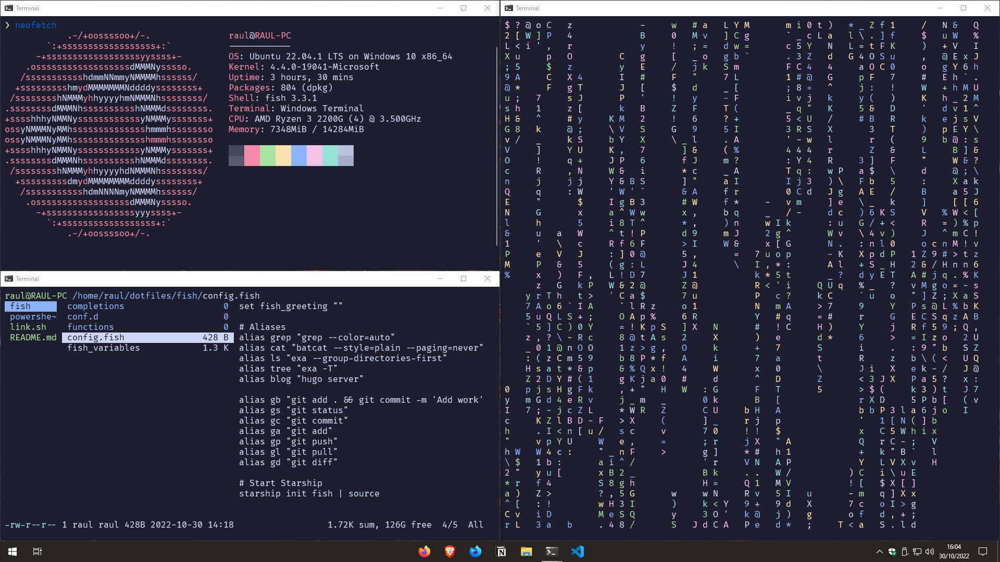

# WSL - Ubuntu

This are my personal **dotfiles** that I use in Windows Subsystem for Linux.


## Installation

1. Clone this repository and change the directory.

```bash
# Using HTTP
$ git clone https://github.com/RaulSanchezzt/dotfiles.git ~/dotfiles && cd ~/dotfiles

# Using SSH
$ git clone git@github.com:RaulSanchezzt/dotfiles.git ~/dotfiles && cd ~/dotfiles
```

2. **Switch** to `wsl` branch.

```bash
$ git checkout wsl
```

3. Run the script to make the symlinks.

```bash
# Give the current user execute permissions
$ chmod +x link.sh

$ ./link.sh
```

4. Create a new symbolic link to the `fish` directory as **root**.

```bash
# ln -sf /home/raul/dotfiles/fish/ ~/.config/fish
```

5. Close the terminal and open another to see the changes

> To update the configuration use git pull inside the dotfiles directory.

## Setup

### Dev tools

- [Git](https://git-scm.com/)
- [Go](https://go.dev/)
    - [Hugo Extended](https://gohugo.io/)
- [PHP](https://www.php.net/)
- [MariaDB](https://mariadb.com/)
- [Python3](https://www.python.org/)
- [Node.js](https://nodejs.org/en/)
    - [npm](https://www.npmjs.com/)


### Command Line

#### Shell

- [Fish](https://fishshell.com/)

#### Plugins

- [fisher](https://github.com/jorgebucaran/fisher)
- [nvm.fish](https://github.com/jorgebucaran/nvm.fish)

#### Prompt

- [Starship](https://starship.rs/)

#### Tools

- [bat](https://github.com/sharkdp/bat)
- [exa](https://github.com/ogham/exa)